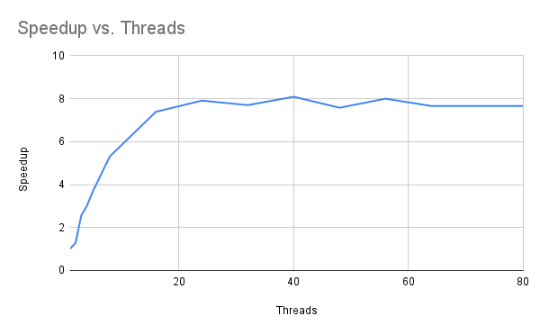

## Multithreaded Timing Results

|Thread Count|Wall Clock Time|User Time|System Time|Speedup|
|:--:|--:|--:|--:|:--:|
|1|14.48|13.89| 0.46|1.00|
|2|11.29|21.52| 0.55| 1.28|
|3| 5.65|15.25| 0.70| 2.56|
|4| 4.80|16.95| 0.74| 3.02|
|5| 3.94|16.80| 0.87| 3.68|
|6| 3.43|16.83| 1.08| 4.22|
|7| 3.03|16.68| 1.19| 4.78|
|8| 2.72|16.69| 1.18| 5.32|
|16| 1.96|18.48| 2.92| 7.39|
|24| 1.83|19.21| 6.79| 7.91|
|32| 1.88|18.54|15.01| 7.70|
|40| 1.79|17.98|24.19| 8.09|
|48| 1.91|17.61|24.07| 7.58|
|56| 1.81|18.49|39.04| 8.00|
|64| 1.89|17.86|32.03| 7.66|
|72| 1.89|17.18|44.21| 7.66|
|80

## Speedup Graph

## Why More Threads Aren’t Always Better

Just like people waiting to get through a turnstile, adding more people doesn’t help if only one can pass at a time. Similarly, more threads increase synchronization and memory overhead. This leads to diminishing returns as thread count rises.

## Amdahl’s Law Calculation (16 Threads)

Serial time: 0.011 + 0.146 = 0.157  
Total time: 14.48  
$s = \frac{0.157}{14.48} ≈ 0.0108$, so $p = 0.9892$

$$
\text{speedup} = \frac{1}{(1 - 0.9892) + \frac{0.9892}{16}} ≈ \boxed{8.29}
$$

## Graph Slope and Flattening

Between 1 and 7 threads:

$$
\text{slope} = \frac{4.78 - 1.00}{6} ≈ 0.63
$$

The speedup flattens after 40+ threads due to:
- Overhead of managing threads
- CPU cores maxed out
- Memory/cache contention
- Serial parts that cannot be parallelized

## Amdahl’s Law Estimate with 16 Threads

Measured serial time: 0.0112 + 0.0000012 = 0.011205  
Total time: 14.2549  

$$
s = \frac{0.011205}{14.2549} ≈ 0.000786 \\
p = 1 - s = 0.999214
$$

Applying Amdahl’s Law with $n = 16$:

$$
\text{speedup} = \frac{1}{(1 - p) + \frac{p}{n}} = \frac{1}{(1 - 0.999214) + \frac{0.999214}{16}} \approx \boxed{12.56}
$$

